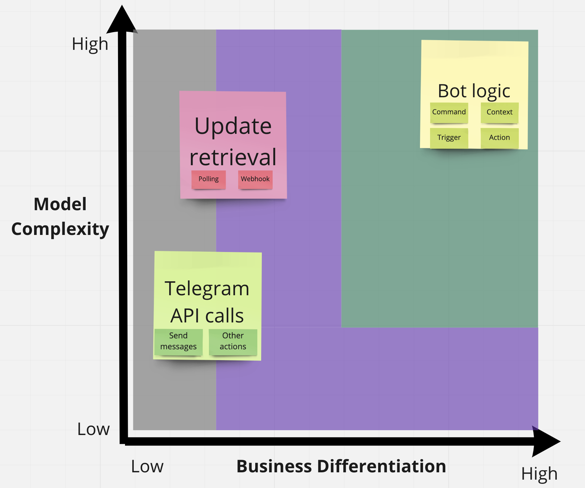

# ScalaGram - Report

## Development process [Rossi]
Processo di sviluppo adottato (modalità di divisione in itinere dei task, meeting/interazioni pianificate, modalità di revisione in itinere dei task, scelta degli strumenti di test/build/continuous integration)

### Divisione dei task
### Meeting ed interazioni
### Strumenti utilizzati

## Requirements [Gruppo]
Requisiti (delle varie tipologie, ossia: 1) business, 2) utente, 3) funzionali, 4) non funzionali, 5) di implementazione)

### Business

Questa sezione è dedicata all'analisi e definizione dei requisiti di business che caratterizzeranno il sistema. L'approccio utilizzato per la definizione del modello è basato sulla filosofia **Domain Driven Design** (DDD). 

È importante asserire sin da subito che l'oggetto dello studio del modello del dominio sono state le [Telegram Bot API](https://core.telegram.org/bots/api).

#### Knowledge crunching

#### Ubiquitous language
### Utente
### Funzionali

- Definire il comportamento di un bot telegram mediante il DSL proposto in maniera dichiarativa.
    1. Definire il **token** del bot in questione.
    2. Definire la **modalità** di esecuzione del bot (e.g. Polling o Webhook), ed i rispettivi parametri, quali l'intervallo di polling ed il timeout delay.
    3. Definire l'insieme di **middleware** assegnandone il rispettivo contesto di attivazione e la conseguente reazione.
    4. Definire un inseme di **reactions** secondo le seguenti sintassi proposte
        - uno
        - due

#### User stories

Si sono sviluppate user stories al fine di poter definire dettagliatamente i principali casi d'uso del framework da parte di un utente finale utilizzatore. Questo passaggio sarà cruciale per poter sviluppare in seguito un domain specific language (DSL) che andrà a ricalcare le user stories con una nuova sintassi dichiarativa, sviluppata ad hoc per venire in contro alle esigente di un utilizzatore.

Questa fase di studio ha portato al seguente output.

- User story generale
- User story che specifica le reactions
- User story che specifica i middleware
- User story che specifica le scene

#### DSL

Comparare la user story con i pezzi di codice/pseudocodice del DSL.

### Non funzionali
### Implementazione

## Architectural Design [Gruppo - Pistocchi]
Design architetturale (architettura complessiva, descrizione di pattern architetturali usati, componenti del sistema distribuito, scelte tecnologiche cruciali ai fini architetturali -- corredato da pochi ma efficaci diagrammi)

### Bounded context [Pistocchi]

Lo studio del problema ha portato a definire tre aree critiche per la definizione del sistema, le quali necessitano un importante isolamento, al fine di garantire indipendenza e chiara suddivisione dei moduli durante la fase di sviluppo. Una corretta suddivisione dei bounded context in fase iniziale permetterà di scomporre in maniera più chiara il lavoro.

Queste decisioni impatteranno in maniera significativa successivamente, quando sarà necessario organizzare e scomporre i moduli di basso livello.

### DSL e user story [Pistocchi]
Architettura del dsl?

## Design Detail
Design di dettaglio (scelte rilevanti, pattern di progettazione, organizzazione del codice -- corredato da pochi ma efficaci diagrammi)

### Scelte rilevanti [Boschi]
In fase di design, si è deciso di seguire la suddivisione definita tramite i Bounded Context, identificando così tre macro aree sviluppabili in maniera indipendente e di conseguenza parallelizzabili le quali, una volta terminate, sarebbero poi state integrate.  
La modellazione dei modelli atti a rappresentare le entità fondamentali è stata definita adattandosi alle [Telegram Bot API](https://core.telegram.org/bots/api), identificando all'interno di classi create ad hoc tutti i campi necessari a rappresentare gli elementi sfruttati da Telegram, richiamando quindi un paradigma OO-FP Mixed.  
Grazie a questa scelta, è stato possibile utilizzare la libreria [Circe](https://circe.github.io/circe/), atta a facilitare e rendere semiautomatiche le operazioni di codifica (in fase di invio) e decodifica (in fase di ricezione) dei json.  
In maniera analoga ai modelli, anche la modalità di utilizzo delle API per interagire con il server Telegram è stata definita facendo riferimento alle direttive fornite dal servizio stesso. 
In questo caso, per garanitre uno sviluppo più possibile funzionale, si è utilizzato il trio di classi [Try, Success, Failure](https://docs.scala-lang.org/overviews/scala-book/functional-error-handling.html), fondamentali per gestire gli errorri in maniera gracefully, siano essi dovuti a problemi nella formattazione dell'URL, del body del messaggio o di connessione.  
Grazie a questa tecnica e all'utilizzo di classi di default nel caso in cui l'encoding/decoding dei json non andasse a buon fine, qulunque failure riesce ad essere intercettata senza causare interruzioni non volute del programma.  
Per quanto concerne il testing, inizialmente si era optato per un testing automatico che, tramite le apposite chiamate HTTP al server Telegram, permettesse di verificare la corretteza sia nell'utilizzo delle API, che nell'encoding della richiesta e nel decoding della risposta.  
Poichè Telegram per evitare attacchi DOS prevede un limite massimo di richeste al minuto, è stato necessario optare per un approccio alternativo, in quanto l'esecuzione di più suite di test in contemporanea portava frequenti fallimenti nonostante le tecniche di retry adottate.  
La correttezza nell'utilizzo delle API viene quindi determinata solamente sulla base della composizione della richiesta stessa, ipotizzando che data una richiesta corretta, possa fallire solo per problemi legati a Telegram o alla connesione.  
Per la fase di interpretazione delle risposte, invece, si è deciso di memorizzare i json di interesse in appositi file e utilizzarli per verificare la correttezza delle operazioni di decodifica.
### Organizzazione del codice [Rossi, Tumedei]
- riferimento ai bounded context

## Implementation
Implementazione (per ogni studente, una sotto-sezione descrittiva di cosa fatto/co-fatto e con chi, e descrizione di aspetti implementativi importanti non già presenti nel design)

### Implementazione - Gianni Tumedei [Logica bot]
### Implementazione - Francesco Boschi [Modelli, marshalling]
### Implementazione - Mattia Rossi [Metodi] 
### Attività di gruppo [Gruppo]
#### DSL 

## OPS
In questa sezione verranno descritti dettagliatamente gli aspetti relativi alla parte di **Operations** (Ops) implementati all'interno del progetto. Con Ops si intendono tutte quelle strategie finalizzate a semplificare ed automatizzare alcuni workflow relativi alla gestione del progetto.

L'utilizzo di un ambiente di Continuous Integration (CI), quale GitHub Actions consentirà di eseguire in maniera automatizzata alcune di queste procedure relative sia alla build automation del progetto, come compilazione, testing e quality assurance, ma anche relative alla gestione del repository ed alla pubblicazione degli artefatti.

Nelle successive sottosezioni verranno descritte tutte le procedure attuate proprio a questo fine.

### Automatic delivery e deployment [Rossi, Pistocchi]

In questa sezione verranno dettagliati gli aspetti relativi alla gestione automatizzata del repository ed alla pubblicazione degli artefatti sulla nota piattaforma Maven Central. Verrà dettagliato inoltre come l'utilizzo dell'integrator ci supporterà interamente durante questa fase.

- La prima domanda da porsi quando si deve pubblicare software è quella di stabilire la modalità di **versioning**. Per il seguente progetto si è deciso di utilizzare il semantic versioning.

- Per effettuare il versioning si sono utilizzati i **tag annotati** di Git.

- Si è sfruttata la possibilità di salvare alcuni **segreti** all'interno dell'integrator, per poi utilizzarli all'interno dei workflows. Si sono salvate ad esempio le credenziali per la pubblicazione su Maven Central.

- Una volta effettuato il tagging tramite il vcs, ci si avvale dell'integrator per effettuare la **pubblicazione della release**. A questo scopo è stato sviluppato un workflow in grado di reagire alla pubblicazione di un tag annotato. Vengono sfruttate due actions pubbliche in grado di creare e pubblicare la release all'interno del repository.

- Ci si avvale allo stesso modo del task precedente, mediante un ulteriore action pubblica, per effettuare la pubblicazione degli artefatti in maniere automatizzata sul **Maven Central** Repository.

### Build automation [Rossi, Pistocchi]

Questa sezione dettaglierà come è stata strutturata la fase di build automation all'interno dell'integrator GitHub Actions.

La fase di build è stata strutturata in un unica fase principale (job). Gli aspetti principali considerati in questa procedura sono i seguenti:

- L'utilizzo di una **matrice di build** ci ha permesso di effettuare riuso di codice per generalizzare sul **sistema operativo** sul quale viene eseguito il workflow di continuous integration e la configurazione della **versione di Java**.

- Si utilizza una action che ci permette di effettuare **l'upload** degli artefatti all'interno dell'ambiente di continuous integration. Questa action viene sfruttata per poter caricare l'output della build, solamente nel caso in cui essa fallisca. Questa proceduta viene effettuate quando si riceve un errore in fasi di compilazione o in fase di test.

- È stato inoltre schedulato un **chron job**, che ci permetterà di eseguire il workflow dedicato alla build automation settimanalmente.

### Licensing [Rossi]
### QA [Boschi, Tumedei]
#### Testing 
##### Testing automatizzato
##### Testing non automatizzato
##### Copertura dei test

## Retrospective [Rossi, Optional[Tumedei]]
Restrospettiva (descrizione finale dettagliata dell'andamento dello sviluppo, del backlog, delle iterazioni; commenti finali)

### Sprint 1 
### Sprint 2
### Sprint 3
### Sprint 4
### Sprint 5
### Sprint 6
### Sprint 7
### Sprint 8

## Conclusioni [Gruppo]
### Sviluppi futuri
### Conclusioni
