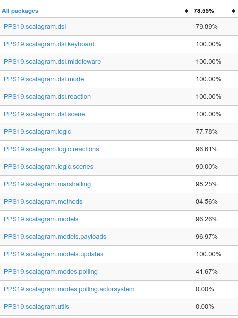

# ScalaGram - Report <!-- omit in toc -->
- [1. Development process](#1-development-process)
  - [1.1 Divisione dei task](#11-divisione-dei-task)
  - [1.2 Meeting ed interazioni](#12-meeting-ed-interazioni)
  - [1.3 Strumenti utilizzati](#13-strumenti-utilizzati)
- [2. Requirements](#2-requirements)
  - [2.1 Requisiti Business](#21-requisiti-business)
    - [Ubiquitous language](#ubiquitous-language)
    - [Knowledge crunching](#knowledge-crunching)
  - [2.2 Requisiti Utente](#22-requisiti-utente)
  - [2.3 Requisiti Funzionali](#23-requisiti-funzionali)
    - [User stories](#user-stories)
    - [DSL](#dsl)
  - [2.4 Requisiti Non funzionali](#24-requisiti-non-funzionali)
  - [2.5 Requisiti Implementativi](#25-requisiti-implementativi)
- [3. Architectural Design](#3-architectural-design)
  - [3.1 Bounded context](#31-bounded-context)
  - [3.2 DSL](#32-dsl)
    - [Bot token](#bot-token)
    - [Mode](#mode)
    - [Middlewares](#middlewares)
    - [Reactions](#reactions)
    - [Scenes](#scenes)
    - [Keyboards](#keyboards)
- [4. Design Detail](#4-design-detail)
  - [4.1 Scelte rilevanti](#41-scelte-rilevanti)
  - [4.2 Organizzazione del codice](#42-organizzazione-del-codice)
- [5. Implementation](#5-implementation)
  - [5.1 Implementazione - Gianni Tumedei](#51-implementazione---gianni-tumedei)
    - [Package PPS19.scalagram.logic](#package-pps19scalagramlogic)
    - [Package PPS19.scalagram.modes](#package-pps19scalagrammodes)
  - [5.2 Implementazione - Francesco Boschi](#52-implementazione---francesco-boschi)
    - [Package PPS19.scalagram.models](#package-pps19scalagrammodels)
    - [Package PPS19.scalagram.marshalling](#package-pps19scalagrammarshalling)
  - [Implementazione - Mattia Rossi](#implementazione---mattia-rossi)
    - [Package PPS19.scalagram.methods](#package-pps19scalagrammethods)
    - [Package PPS19.scalagram.examples](#package-pps19scalagramexamples)
  - [Attività di gruppo](#attività-di-gruppo)
    - [Package PPS19.scalagram.dsl](#package-pps19scalagramdsl)
      - [Package object dsl](#package-object-dsl)
      - [Trait ScalagramDSL](#trait-scalagramdsl)
      - [Packages keyboard, middleware, mode, reaction, scene](#packages-keyboard-middleware-mode-reaction-scene)
- [6. OPS](#6-ops)
  - [6.1 Automatic delivery e deployment](#61-automatic-delivery-e-deployment)
    - [Pubblicazione degli artefatti su Maven Central](#pubblicazione-degli-artefatti-su-maven-central)
  - [6.2 Build automation](#62-build-automation)
    - [Gestione automatizzata delle dipendenze](#gestione-automatizzata-delle-dipendenze)
  - [6.3 Licensing](#63-licensing)
  - [6.4 Quality Assurance](#64-quality-assurance)
    - [Testing](#testing)
      - [Testing automatizzato](#testing-automatizzato)
      - [Testing non automatizzato](#testing-non-automatizzato)
    - [Coverage](#coverage)
    - [Code style](#code-style)
- [7. Retrospective](#7-retrospective)
  - [7.1 Sprint 1 (18/01/2020)](#71-sprint-1-18012020)
  - [7.2 Sprint 2 (25/01/2020)](#72-sprint-2-25012020)
  - [7.3 Sprint 3 (01/02/2020)](#73-sprint-3-01022020)
  - [7.4 Sprint 4 (08/02/2020)](#74-sprint-4-08022020)
  - [7.5 Sprint 5 (15/02/2020)](#75-sprint-5-15022020)
  - [7.6 Sprint 6 (22/02/2020)](#76-sprint-6-22022020)
  - [7.7 Sprint 7 (01/03/2020)](#77-sprint-7-01032020)
  - [7.8 Sprint 8 (08/03/2020)](#78-sprint-8-08032020)
- [8. Conclusioni](#8-conclusioni)
  - [8.1 Sviluppi futuri](#81-sviluppi-futuri)
  - [8.2 Conclusioni](#82-conclusioni)

## 1. Development process

Lo sviluppo del sistema verrà effettuato adottando un processo simil-Scrum, viste le ridotte dimensioni del team e la conseguente impossibilità di adottare Scrum in pieno. L'approccio utilizzato prevede la suddivisione in Scrum-Task anche di tutta la parte progettuale del sistema e di bootstrap del progetto, comprese la definizione dei requisiti, la configurazione degli ambienti (IntelliJ, Gradle, GitHub e GitHub Actions) e la stesura di questo report.

### 1.1 Divisione dei task

La divisione dei ruoli all'interno del team è la seguente:

**Gianni Tumedei**: *product owner* e *sviluppatore*. Responsabile dello sviluppo e testing delle seguenti funzionalità:
- Gestione della logica di funzionamento del bot
- Gestione delle modalità di recupero degli update

**Francesco Boschi**: *scrum master* e *sviluppatore*. Responsabile dello sviluppo e testing delle seguenti funzionalità:
- Gestione dei modelli delle entità del sistema
- Codifica e decodifica delle informazioni

**Mattia Rossi**: *sviluppatore*. Responsabile dello sviluppo e testing delle seguenti funzionalità:
- Gestione dei metodi di Telegram
- Gestione degli errori e dell'output

Per quanto concerne la realizzazione delle componenti sviluppate in comune, queste sono le seguenti:
- Sviluppo del DSL
- Creazione dei Bot di esempio

### 1.2 Meeting ed interazioni

I componenti del team si prefissano di realizzare meeting con cadenza giornaliera tramite videochiamate, principalmente effettuate tramite Microsoft Teams e Discord, al fine di mantenersi aggiornati sullo stato del progetto e sull'avanzamento dei singoli task. Con cadenza settimanale, per la precisione alla fine di ogni sprint, si terrà invece un meeting in cui verranno definiti i task da includere nella fase di sprint successiva. Le interazioni tra i componenti del team si mantengono comunque frequenti per convenire su eventuali dettagli di minore entità all'interno del progetto.

### 1.3 Strumenti utilizzati

- **IntelliJ IDEA**: IDE utilizzato per lo sviluppo del progetto, scelto perché fornisce supporto completo per lavorare con il linguaggio Scala
- **Git**: utilizzato come version control system per tenere traccia dello sviluppo in itinere del progetto. Sono stati tracciati i file sorgente, di test, di configurazione della build e quelli di backlog.
- **GitHub**: scelto come servizio di repository
- Gradle: utilizzato come tool per eseguire la build del sistema
- **GitHub Actions**: servizio integrato all'interno di GitHub per la CI (continuos integration) per eseguire la build del progetto in sistemi eterogenei
- **Scoverage**: utilizzato per calcolare la copertura dei test implementati, al fine di stabilire la percentuale minima di sistema non "coperto" e quindi soggetto a eventuali bug.
- **Trello**: è stato utilizzato in maniera distribuita per definire nel dettaglio le attività presenti nel backlog. In particolare sono state definite le seguenti sezioni:
  - To do: task che devono ancora essere sviluppati
  - In progress: lo sviluppo del task è iniziato ma non concluso
  - Done: contiene i task che sono stati completati
  - Paused: contiene i task che erano in progresso e sono stati momentaneamente sospesi
  - Aborted: contiene i task definitivamente cancellati
- **Google Docs**: utilizzato sia per scrivere il backlog settimanale che gli appunti riguardanti il design,
-  l'architettura e le user story del progetto

## 2. Requirements

### 2.1 Requisiti Business

Questa sezione è dedicata all'analisi e definizione dei requisiti di business che caratterizzeranno il sistema. L'approccio utilizzato per la definizione del modello è basato sulla filosofia **Domain Driven Design** (DDD).\
L'obiettivo del progetto è lo sviluppo di una libreria per la creazione di bot per la piattaforma di messaggistica Telegram.\
Il progetto è nato grazie alla passione di alcuni membri del gruppo per lo sviluppo di bot Telegram e a causa dell'assenza di un pratico framework/libreria in Scala che li soddisfacesse.
Questo capitolo è suddiviso nelle sezioni Ubiquitous language e Knowledge crunching.

#### Ubiquitous language
Questa sezione riporta le terminologie tecniche che sono emerse durante durante tutto lo svolgimento del progetto accompagnate dalla loro definizione.\
Nei capitoli successivi di questo documento si farà riferimento a questi termini dandone per assodato il significato.
| Termine                        | Significato                                                                                                                                                                                                                                                                                                                                                     |
| ------------------------------ | --------------------------------------------------------------------------------------------------------------------------------------------------------------------------------------------------------------------------------------------------------------------------------------------------------------------------------------------------------------- |
| User/Utente                    | Un entità che interagisce con Telegram. Può essere sia un utente umano che un programma (Bot). È identificato da uno user ID, che è anche usato da altri utenti per interagire con esso.                                                                                                                                                                        |
| Human user/Utente umano        | Persona identificata dall'account che utilizza.                                                                                                                                                                                                                                                                                                                |
| Account                        | Un account di Telegram identifica un utente umano ed è associato con un numero telefonico/email univoco e un User.                                                                                                                                                                                                                                              |
| Bot                            | User automatizzato. Un Bot deve essere creato da un utente umano, che ne è anche il proprietario. Un Bot è identificato da un token univoco.                                                                                                                                                                                                                    |
| Chat                           | Una conversazione tra due o più utenti, identificata da un ID.                                                                                                                                                                                                                                                                                                  |
| Private chat/Chat privata      | Una conversazione tra due utenti.                                                                                                                                                                                                                                                                                                                               |
| Channel/Canale                 | Una chat a senso unico, in cui gli amministratori possono pubblicare messaggi (in questo caso chiamati anche post), e gli utenti (in questo caso chiamati anche iscritti o subscribers) possono leggerli. I canali sono identificati da un chat ID e da un channel name.                                                                                        |
| Gruppo                         | Una conversazione tra un gruppo di utenti. Il gruppo è gestito da amministratori.                                                                                                                                                                                                                                                                               |
| Private channel/Canale privato | Canale a cui hanno accesso solamente amministratori e utenti iscritti, che possono essere aggiunti manualmente dagli amministratori oppure iscriversi tramite un link di invito.                                                                                                                                                                                |
| Public channel/Canale pubblico | Canale di cui chiunque può visualizzare i messaggi (anche senza effettuare il login su Telegram) e chiunque può iscriversi.                                                                                                                                                                                                                                     |
| Message/Messaggio              | Qualsiasi contenuto inviato in una chat o in un canale. I più semplici sono messaggi di testo, ma altri formati includono note vocali e video, immagini statiche, GIF, file audio, file video, qualsiasi altro file, adesivo, sondaggio, posizione, contatto. I Bot possono anche inviare messaggi di risposta. Un messaggio è identificato da un ID messaggio. |
| Command/Comando                | Un messaggio che inizia con il carattere "/", utile per invocare in maniera semplice dei trigger.                                                                                                                                                                                                                                                               |
| Pin                            | Azione di fissare un messaggio in una chat, per mantenerli sempre visibili nella parte alta.                                                                                                                                                                                                                                                                    |
| Unpin                          | Rimozione del pin da un messaggio fissato. Può essere eseguita sul singolo o su tutti i messaggi fissati.                                                                                                                                                                                                                                                       |
| Update                         | Tutti gli eventi che accadono all'interno di Telegram sono wrappati in un update, che viene inviato agli utenti interessati ed è identificato da un update ID.                                                                                                                                                                                                  |
| Polling                        | Modalità di reperimento degli update nella quale si contattano periodicamente i server di Telegram per scaricare quelli disponibili.                                                                                                                                                                                                                            |
| Webhook                        | Modalità di reperimento degli update nella quale sono sono i server di Telegram a inoltrarli ad un URL pubblico. Richiede una fase di configurazione nella quale il token del bot viene associato a tale URL.                                                                                                                                                   |
| Token                          | Identificatore univoco di un bot. Tramite esso è possibile controllare le azioni del bot, pertanto va mantenuto privato. Può essere trasferito da un utente ad un altro per cambiarne il proprietario.                                                                                                                                                          |
| Trigger                        | Logica secondo la quale un bot reagisce ad un update.                                                                                                                                                                                                                                                                                                           |
| Action/Azione                  | Una serie di attività eseguite in seguito all'attivazione di un trigger.                                                                                                                                                                                                                                                                                        |
| Reaction                       | Combinazione di un trigger e dell'azione corrispondente.                                                                                                                                                                                                                                                                                                        |
| Context/Contesto               | Container per tutti i dati che un bot deve memorizzare tra un update e l'altro. Il context è identificato dalla chat a cui fa riferimento e contiene soltanto i dati ad essa relativi in modo da isolare le varie conversazioni.                                                                                                                                |
| Scene/Scena                    | Interazione ben definita con il bot composta da uno o più step che devono essere eseguiti in un certo ordine.                                                                                                                                                                                                                                                   |
| Step                           | Reaction all'interno di una scena.                                                                                                                                                                                                                                                                                                                              |
| Middleware                     | Elemento che processa ogni update e determina se inoltrarlo e scartarlo.                                                                                                                                                                                                                                                                                        |

#### Knowledge crunching

Questa è stata la fase iniziale del progetto, durante la quale si è cercato di effettuare una panoramica sul dominio che consiste nella piattaforma Telegram e nelle relative [Bot API](https://core.telegram.org/bots/api).\
La maggior parte delle terminologie inserite nella sezione Ubiquitous Language sono emerse durante questa fase e non sono quindi riportati anche in questo capitolo.

Telegram è un è un servizio di messaggistica istantanea e broadcasting basato su cloud. I client ufficiali di Telegram sno distribuiti sotto forma di software open-source per Android, Linux, IOS, MacOS e Microsoft Windows. \
Dal 2015 Telegram ha introdotto due funzionalità che lo hanno distinto particolarmente dalla concorrenza: i canali e una piattaforma dedicata alla creazione e alla gestione di bot.\
Questi ultimi sono utenti virtuali che forniscono molteplici funzionalità in maniera totalmente automatizzata e sono l'oggetto di principale interesse del progetto.

La creazione stessa dei bot e la loro gestione sono demandate al bot ufficiale di Telegram, **BotFather**, che permette ad ogni utente di:

- Creare, elencare e cancellare i propri bot
- Modificare nome, descrizione, bio, immagine, comandi suggeriti e impostazioni di privacy e pagamenti dei propri bot
- Trasferire la proprietà dei bot ad altri utenti

BotFather non consente quindi di definire il comportamento dei bot. Tale compito deve essere definito in un software esterno che ottiene aggiornamenti da Telegram in modalità push (webhook mode) o pull (polling mode) e li processa secondo la logica definita dal programmatore del bot.

Telegram mette a disposizione delle [API](https://core.telegram.org/bots/api) per permettere lo sviluppo dei bot.\
La community Telegram ha creato numerose librerie in vari linguaggi di programmazione che forniscono astrazioni di più alto livello sulle API. Il progetto Scalagram ricade in questa categoria.

### 2.2 Requisiti Utente

Gli utenti finali del progetto sono gli sviluppatori che sfruttano la libreria Scalagram per la realizzazione di bot Telegram.\
La libreria deve mettere a disposizione gli strumenti per la programmazione di un bot sfruttando un apposito DSL.\
Nel caso in cui un utilizzatore abbia necessità specifiche, deve inoltre essere possibile utilizzare qualsiasi funzionalità della libreria senza far uso del DSL.

### 2.3 Requisiti Funzionali

Le funzionalità che la libreria deve mettere a disposizione sono state definite tramite la stesura delle user stories e del diagramma dei casi d'uso.

#### User stories

Al termine della fase di knowledge crunching si sono sviluppate user stories col fine di poter definire dettagliatamente i principali casi d'uso della libreria da parte di un utente finale, ossia uno sviluppatore software. Questo passaggio è risultato cruciale per poter in seguito definire un DSL che ricalcasse le user stories con una nuova sintassi dichiarativa, sviluppata ad hoc per venire in contro alle esigente del cliente.

Le user stories sono definite dal punto di vista di un developer, che deve poter:

- Definire il token appartenente al bot
- Definire un middleware associato al bot
- Definire una specifica reaction eseguibile dal bot composta da trigger e action
- Definire uno step per una specifica scena
- Avviare l'esecuzione del bot in modalità polling, opzionalmente specificandone i parametri
- Bypassare il DSL in caso di esigenze particolari

A partire dalle user stories è stato definito il seguente diagramma dei casi d'uso:

<p align="center">
  
</p>
<p align="center">Figura 2.1 - Diagramma dei casi d'uso</p>

#### DSL

Il DSL deve essere sviluppato con l'idea di fornire un ulteriore livello di astrazione rispetto alle funzionalità già offerte dalla libreria.

### 2.4 Requisiti Non funzionali

Dal momento che implementare tutti i metodi resi disponibili dalle API di Telegram e la modalità webhook avrebbe richiesto un tempo superiore a quello disponibile per il progetto, alcune funzionalità non sono state implementate. Per questo motivo il team si è posto come obiettivo quello di realizzare la libreria adottando un'architettura facilmente estendibile, in modo da far fronte a eventuali sviluppi futuri.

### 2.5 Requisiti Implementativi

Durante lo sviluppo si è deciso di distaccarsi da un approccio puramente Object Oriented adottandone uno OO-FP Mixed favorito dal linguaggio Scala.

## 3. Architectural Design

### 3.1 Bounded context

Lo studio del problema ha portato a definire tre aree critiche che compongono il sistema, le quali necessitano un importante isolamento, al fine di garantire indipendenza e chiara suddivisione dei moduli durante la fase di sviluppo. Una corretta suddivisione dei bounded context in fase iniziale permetterà di scomporre in maniera più chiara il lavoro.

Sono stati definiti i seguenti bounded context:
- **Bot logic context**: è il core del sistema, comprende le funzionalità dedicate alla definizione della logica di comportamento del bot
- **Telegram API calls context**: racchiude tutte le interazioni con le API di Telegram. Ad esempio, il download degli update e l'invio dei messaggi sono isolati in questo bounded context
- **Update retrieval context**: si appoggia al context delle Telegram API calls per ottenere gli update e si occupa quindi del loro smistamento

Di seguito è riportata la context map del progetto, da notare che i modelli relativi alle entità restituite dalle API di Telegram sono legati più strettamente al context delle Telegram API calls, ma vengono sfruttati di frequente anche dalla logica del bot, pertanto si trovano in un'intersezione tra i due context.

Queste decisioni impatteranno in maniera significativa successivamente, quando sarà necessario organizzare e scomporre i moduli di basso livello.

<p align="center">
  
</p>
<p align="center">Figura 3.1 - Context map</p>

### 3.2 DSL

Dal momento che il DSL della libreria fa da wrapper a tutte le altre funzionalità, la parte di design relativa alla sua sintassi è stata affrontata a partire dal quarto sprint, quando le funzionalità core della libreria erano ormai sufficientemente solide.

Di seguito sono riportati tutti i costrutti sintattici del linguaggio.

#### Bot token
Permette di settare il token del bot.
```scala
token("<TOKEN>")
```

#### Mode
Permette di settare la modalità di download degli update.
```scala
mode(Polling)
```
Opzionalmente è possibile specificare l'intervallo di polling e timeout.
```scala
mode(Polling interval 300.milliseconds timeoutDelay 1.days)
```

#### Middlewares
Permette di settare i middleware del bot.
```scala
middlewares (

  <> { context =>
    ...
    true
  }

  <> { context =>
    println(context.update)
    true
  }
)
```

#### Reactions
Permette di settare le reaction del bot.\
Ogni reaction è formata da due parti. La prima indica che tipo di evento deve avvenire mentre la seconda quale azione va effettuata in seguito a tale evento.\
Lo snippet di codice sottostante riporta tutte le tipologie di reaction che è possibile creare con il DSL, correlate da opportuni commenti.
```scala
reactions (

  // React to the "/start" message
  !!
  >> "Welcome!"

  // React to to the "/hello" message
  << "/hello"
  >> "Hi there"

  // React to a message with content equal to one of this strings
  << ("message" | "another message" | "one more message")
  >> { context =>
    ...
  }

  // React to any incoming message
  << *
  >> "Ok"

  // React to to a callback query with "callback" as data
  <~ "callback"
  >> "callback reply"

  // Reply to the "/html" command by sending a message interpreted as HTML
  << "/html"
  >> HTML("<b>Ciao Gianni</b>")

  // Reply to the "/markdown" command by sending a message interpreted as Markdown
  << "/markdown"
  >> MD("**Ciao Gianni**")

  // Reply to the "/keyboard" command by sending a message with an attached keyboard
  << "/keyboard"
  >> "Hi" - Keyboard(...)

  // React to an edited message with new content equal to "edited message"
  <* "edited message"
  >> "A message has been edited"

  // React to an edited message with new content equal to one of the given strings
  <* ("edited message" | "another edited message")
  >> "A message has been edited"

  // React to to any edited message
  <* *
  >> "A message has been edited"

  // React to any pinned message
  <^ *
  >> "A message has been pinned"

  // React to to a new user entering a chat
  <+ *
  >> "Welcome"

  // React to a user leaving a chat
  </ *
  >> "Goodbye"

  // React to to an incoming message that passes the given regular expression
  <# "regexp"
  >> "reply"

)
```

#### Scenes
Permette di settare le scene del bot.\
Ogni `Scene` è composta da un nome e da una serie di `Step`. Gli step sono a loro volta composti da un nome e da un'action, ossia una funzione `Context => Boolean`.
```scala
scenes (

  scene (
    "SCENE_NAME"

    <| "STEP1_NAME"
    >> { context =>
      context.reply("Reply")
      context.nextStep()
    }

    <| "STEP2_NAME"
    >> { context =>
      ...
    }
  )

  scene (
    "ANOTHER_SCENE"

    <| "STEP"
    >> "Reply"
  )

)
```

#### Keyboards
Il DSL per le keyboard è stato strutturato in modo da rendere il più possibile evidente il layout della tastiera, al contempo mantenendo un elevato grado di espressività dal punto di vista delle azioni dei pulsanti.

Per le tastiere di tipo `ReplyKeyboardMarkup`, un normale bottone può essere creato semplicemente passando una stringa al metodo `Keyboard`.\
Le tastiere inline (`InlineKeyboardMarkup`) non possono avere bottoni solo testuali, ma è necessario indicare per ognuno di essi il campo `callbackData`. Per semplificare questa operazione, vi è anche in questo caso la possibilità di passare una semplice stringa al metodo `InlineKeyboard` per creare un bottone il cui valore del campo `callbackData` equivale al suo contenuto testuale.

Seguono alcuni esempi.

Tastiera con un bottone sulla prima riga e due sulla seconda
```scala
Keyboard(
  "Button 1",
  "Button 2" :: "Button 3"
)
```

Tastiera inline contenente vari link
```scala
InlineKeyboard(
  Link("GitHub" -> "https://www.github.com"),
  Link("Bitbucket" -> "https://www.bitbucket.org")
)
```

Altri esempi di bottoni che è possibile creare
```scala
Callback("Button text" -> "callbackData")
Location("Button")
Contact("Button")
```

## 4. Design Detail

Design di dettaglio (scelte rilevanti, pattern di progettazione, organizzazione del codice -- corredato da pochi ma efficaci diagrammi)

### 4.1 Scelte rilevanti

In fase di design, si è deciso di seguire la suddivisione definita tramite i Bounded Context, identificando così tre macro aree sviluppabili in maniera indipendente e di conseguenza parallelizzabili le quali, una volta terminate, sarebbero poi state integrate.

Nello sviluppo del DSL, col fine di avere un linguaggio il più possibile comprensibile e intuitivo, si è fatto ampio uso dello **zucchero sintattico** messo a disposizione da Scala, come per esempio:

- Possibilità di utilizzare metodi unari come operatori **infissi**
- Pattern **Pimp My library** per fornire in maniera implicita metodi, conversioni ed estendere tipi esistenti
- Possibilità di utilizzare **parentesi graffe** per istanziare liste con un solo argomento
- Possibilità di omettere la parola chiave **new** nella creazione di un istanza

L'implementazione dei modelli atti a rappresentare le entità fondamentali è stata definita **adattandosi** alle [Telegram Bot API](https://core.telegram.org/bots/api), identificando all'interno di classi create ad hoc tutti i campi necessari a rappresentare gli elementi sfruttati da Telegram, richiamando quindi un paradigma OO-FP Mixed.\
Grazie a questa scelta, è stato possibile utilizzare la libreria [Circe](https://circe.github.io/circe/), atta a facilitare e rendere semiautomatiche le operazioni di codifica (in fase di invio) e decodifica (in fase di ricezione) dei JSON.

In maniera analoga ai modelli, anche la modalità di utilizzo delle **API** per interagire con il server Telegram è stata definita facendo riferimento alle linee guida fornite dalla piattaforma stessa.\
In questo caso, per garantire uno sviluppo più possibile funzionale, si è utilizzata la monade [Try](https://docs.scala-lang.org/overviews/scala-book/functional-error-handling.html), fondamentali per gestire gli errori in maniera **gracefully**, siano essi dovuti a problemi nella formattazione dell'URL, del body del messaggio o di connessione.\
Grazie a questa tecnica e all'utilizzo di classi di default nel caso in cui l'encoding/decoding dei JSON non andasse a buon fine, qualunque failure riesce ad essere intercettata senza causare interruzioni non volute del programma.

Per quanto concerne il testing, inizialmente si era optato per un testing totalmente automatizzato che, tramite apposite chiamate HTTP al server Telegram, permettesse di verificare la correttezza sia nell'utilizzo delle API, che nell'encoding della richiesta e nel decoding della risposta.\
Poiché Telegram, per evitare attacchi DOS, prevede un limite massimo di richieste al minuto, è stato necessario optare per un approccio alternativo, in quanto l'esecuzione di più suite di test in contemporanea portava frequenti fallimenti nonostante le tecniche di retry adottate.\
La correttezza nell'utilizzo delle API viene quindi determinata solamente sulla base della composizione della richiesta stessa, ipotizzando che data una richiesta i cui campi sono corretti, essa possa fallire solo per problemi esterni alla libreria.\
Per la fase di interpretazione delle risposte, invece, si è deciso di memorizzare i JSON di interesse in appositi file e utilizzarli per verificare la correttezza delle operazioni di decodifica.

### 4.2 Organizzazione del codice

L'organizzazione dei package del progetto riflette i bounded context definiti in fase di design. Il core delle funzionalità nei seguenti package:
- `methods`: corrisponde al bounded context **Telegram API calls** contiene l'implementazione di tutti i metodi delle API di Telegram che si è deciso di implementare nella libreria. I metodi principali in questo package sono `GetUpdates` e `SendMessage`.
- `modes`: corrisponde al bounded context **Update retrieval**, la modalità di download degli update che si è deciso di adottare è polling, la cui infrastruttura è implementata all'interno di questo package.
- `logic`: fa riferimento al bounded context **Bot logic**, questo package contiene tutti gli strumenti che la libreria fornisce agli sviluppatori per definire il comportamento del bot, ovvero come esso deve reagire a determinate situazioni. In particolare, il package `reactions` mette a disposizione una serie di factory per la creazione di reaction che permettono al bot di rispondere a eventi come la ricezione di messaggi, o l'entrata/uscita di un utente dalla chat. Questo package include anche l'implementazione delle seguenti classi core della libreria: `Scalagram`, `Context`, `Reaction`, `Scene` e `Middleware`.
- `models`: questo package è strettamente correlato con `methods` in quanto fornisce la definizione di tutte le entità inviate o ricevute tramite le API di Telegram, come `Update` e `TelegramMessage`.
- `dsl`: il dsl della libreria fa da wrapper alle sue funzionalità principali, tutte le definizioni necessarie per la sua realizzazione sono contenute in questo package. Esse sono suddivise in ulteriori package in base al concetto che rappresentano. I package in questione sono: `keyboard`, `middleware`, `mode`, `reaction` e `scene`.
- `marshalling`: contiene i metodi necessari per la conversione di stringhe tra camel case e snake case, utilizzati in fase di decodifica degli update e codifica delle richieste da inviare alle API di Telegram.
- `utils`: contiene alcuni metodi di utility privati utilizzati all'interno della libreria.
- `examples`: contiene alcuni bot di esempio a cui gli sviluppatori possono fare riferimento.

<p align="center">
  
</p>
<p align="center">Figura 4.1 - Organizzazione del codice</p>

## 5. Implementation

Implementazione (per ogni studente, una sotto-sezione descrittiva di cosa fatto/co-fatto e con chi, e descrizione di aspetti implementativi importanti non già presenti nel design)

### 5.1 Implementazione - Gianni Tumedei

Gianni Tumedei è responsabile dell'implementazione dei seguenti componenti:

#### Package PPS19.scalagram.logic

Il package `logic` contiene le entità che sono poi usate come building blocks per la definizione della logica dei bot: `Operation`, `Trigger`, `Action`, `Reaction`, `Scene`, `Step`.

Il package `PPS19.scalagram.logic.reactions` contiene il trait `ReactionBuilder`, che sfrutta le entità sopra citate, in combinazione con il **pattern builder**, per facilitare all'utente finale la creazione di complicati trigger da utilizzare all'interno del bot. I builder messi a disposizione dalla libreria sono i seguenti:
- `OnMessage(strings: String*)`: permette al bot di reagire alla ricezione di un messaggio il cui contenuto corrisponde ad un elemento della lista di stringhe passate come parametro (è possibile non passare stringhe per reagire alla ricezione di qualsiasi messaggio)
- `OnStart()`: è uno shortcut per eseguire `OnMessage("/start")`, utile in quanto tutti i bot devono disporre di un comando `/start`
- `OnHelp()`: è uno shortcut per eseguire `OnMessage("/help")`
- `OnMessageEdited(strings: String*)`: permette al bot di reagire alla modifica di un messaggio il cui nuovo contenuto corrisponde ad un elemento della lista di stringhe passate come parametro (è possibile non passare stringhe per reagire alla modifica di qualsiasi messaggio)
- `OnMessagePinned()`: permette al bot di reagire all'evento di pin di un messaggio
- `OnCallbackQuery(callbackData: String)`: permette al bot di reagire in seguito alla pressione del bottone di una tastiera inline con uno specifico `callbackData`, il cui evento associato è detto *callback*
- `OnChatEnter()`: permette al bot di reagire in seguito all'aggiunta di uno o più utenti ad una chat
- `OnChatLeave()`: permette al bot di reagire in seguito alla rimozione di un utente da una chat
- `OnMatch(regex: String)`: permette al bot di reagire in seguito alla ricezione di un messaggio che fa match con una regular expression passata come parametro

Il trait `Scalagram` rappresenta un bot Telegram creato con questa libreria. Oltre alle operazioni che caratterizzano il bot, mette a disposizione degli shortcut ai metodi definiti nel package `PPS19.scalagram.methods`, in modo da facilitare lo sviluppatore finale e ridurre il numero di import da egli richiesto.\
Il companion object di `Scalagram` fornisce un'implementazione immutabile e privata del trait, utilizzata nel metodo `apply`. Inoltre, sempre per migliorare la quality of life dello sviluppatore finale, sono qui inseriti dei riferimenti ai metodi di `PPS19.scalagram.logic.reactions`.

Il trait `Context` rappresenta, appunto, il contesto di esecuzione di un bot. Esiste un'istanza di `Context` per ogni chat su cui il bot sta comunicando, che contiene vari shortcut utili allo sviluppatore finale, come:
- Un riferimento al bot
- Una `Map` su cui è possibile memorizzare dati tra un'interazione e l'altra
- Un riferimento alla chat del `Context`
- Un riferimento all'ultimo `Update` ricevuto, al suo `Payload` e allo `User` che lo ha generato
- Un metodo `reply`, da utilizzare come alternativa rapida a `sendMessage` in quanto permette di omettere la chat di destinazione, valorizzandola automaticamente a quella attuale

`Context` include poi i metodi necessari all'attivazione delle `Scene` e dei loro `Step`.\
Il companion object di `Context` fornisce un'implementazione privata del trait, sfruttata dal metodo `apply`.

#### Package PPS19.scalagram.modes

Questo package contiene la componente del sistema che si occupa di reperire gli update, distribuirli tra i `Context` presenti e processarli secondo la logica definita dallo sviluppatore finale del bot.

Lo smistamento degli update viene effettuato attraverso un Actor System Akka.\
Il sistema è composto da due tipologie di attori:
- **UpdateDispatcherActor**: ne esiste una sola istanza per ogni bot. Si occupa di reperire periodicamente gli update tramite il metodo `GetUpdates` di `PPS19.scalagram.methods` e smistare ciascuno di essi all'opportuno WorkerActor, in base alla chat da cui proviene l'update
- **WorkerActor**: il sistema comprende un'istanza di questo attore per ogni chat su cui il bot sta avendo conversazioni. Vi è quindi un'associazione unaria tra `Context`, `Chat` e `WorkerActor`.\
  Quando WorkerActor riceve un messaggio contenente un update da processare, fa passare quest'ultimo attraverso una pipeline composta dai seguenti elementi, nell'ordine in cui sono specificati:
    - Tutti i middleware del bot, in ordine di dichiarazione
    - Tutte le reaction del bot, in ordine di dichiarazione
    - Se presente, lo step attuale della scena attiva sullo specifico Context

  Tutti gli elementi della pipeline ereditano dal trait `Operation` e hanno pertanto un metodo `operation: Context => Boolean` che restituisce:
    - `true` se la pipeline deve continuare
    - `false` se l'update è da considerarsi processato e la pipeline va interrotta

  Se un update giunge in fondo alla pipeline senza essere processato, viene semplicemente scartato in quanto la logica del bot non prevede di gestirlo.

L'Actor System può essere configurato dallo sviluppatore finale con i seguenti parametri, da fornire al costruttore della modalità `Polling`:
- `pollingInterval`: intervallo che deve intercorrere tra un'operazione di `GetUpdates` e l'altra (default: 300ms)
- `timeoutDelay`: intervallo dopo il quale un `WorkerActor`, se non ha ricevuto messaggi, termina, con conseguente distruzione del `Context` associato e perdita della traccia della conversazione da parte del bot (default: 1 giorno)\
  È opportuno notare che solitamente i bot Telegram restano in esecuzione per periodi molto lunghi di tempo, ma sono pensati per avere brevi conversazioni con molti utenti. Pertanto è preferibile mantenere un `timeoutDelay` di durata ragionevole, in modo da non inquinare l'Actor System con `WorkerActor` dormienti che non effettuano alcuna operazione. Nel caso in cui un bot debba memorizzare informazioni importanti o con una durata di vita elevata, è buona pratica non utilizzare variabili in memory, ma appoggiarsi ad un database, in modo anche da far fronte ad eventuali perdite di dati dovute a crash.

Nel caso in cui si decidesse di supportare ulteriormente la libreria implementando anche la modalità Webhook, l'Actor System è stato strutturato in modo da non dover subire drastici cambiamenti per supportare anche un tipo di operatività unicamente push, in aggiunta a quella pull attuale. In modalità Webhook poi sarebbe necessaria la creazione di un server HTTP a cui Telegram può inoltrare gli update, ma anche questa operazione è disponibile tramite Akka.

### 5.2 Implementazione - Francesco Boschi

Boschi Francesco è responsabile dell'implementazione delle seguenti componenti:

#### Package PPS19.scalagram.models

Il seguente package contiene tutti i file atti a definire le entità relative alle API di Telegram e le operazioni di codifica e decodifica in JSON delle stesse.

Sebbene i modelli presenti siano in grande numero, la struttura utilizzata è simile per tutti e rispecchia il paradigma OO-FP Mixed, essendo presenti riferimenti al classico OO come gerarchie tra classi e trait atti a definire contratti comuni, oltre a elementi tipici di FP come companion object che fungono da contenitori di impliciti o Factory.

Elemento fondamentale che accomuna la maggior parte di queste classi è la sezione dedicata alla **derivazione semiautomatica** messa a disposizione dalla libreria Circe.\
L'utilizzo di deriveDecoder, permette di decodificare in maniera automatica un JSON creando un oggetto della classe corrispondente, basandosi sul match tra i field del JSON e quelli della classe che verrà istanziata.\
Nel caso in cui un trait fosse ereditato da più classi, quindi, tramite un apposito implicito definito all'interno del **companion object**, viene selezionata la classe che sarà istanziata in maniera automatica o sulla base di parametri specifici, come nel caso della classe MessageEntity nella quale la derivazione viene fatta sulla base del valore assunto da uno specifico campo.

Per le classi utilizzate in fase di invio di un messaggio, ad esempio per la creazione di tastiere, è inoltre presente un **Encoder**, sempre messo a disposizione da Circe, utilizzato per convertire in maniera automatica o sulla base di uno specifico parametro un'istanza di tale classe in formato JSON.

In fase di ricezione di un update la classe **Update** è incaricata dell'avvio delle operazioni di derivazione semiautomatica e deve quindi convertire l'intero JSON in stile camel case così da assicurare la corrispondenza tra i campi del JSON e delle classi.

La stessa operazione di conversione in camel case deve essere effettuata in fase di decodifica da tutte le classi le cui istanze possono essere restituite da una chiamata alle API di Telegram, come ad esempio **TelegramMessage**.

In questa sezione del progetto, quindi, il pattern maggiormente presente è certamente **Pimp My library**, utilizzato per estendere le classi messe a disposizione dalla libreria Circe.

#### Package PPS19.scalagram.marshalling

Poiché tutti i campi all'interno dei JSON sfruttati da Telegram sono definiti seguendo il formato [snake_case](https://en.wikipedia.org/wiki/Snake_case), al contrario di quelle definite via codice che seguono quello [camelCase](https://en.wikipedia.org/wiki/Camel_case), il package marshalling è incaricato di eseguire le conversioni tra i due stili.

Si è deciso quindi di utilizzare due classi implicite che wrappassero le classi Decoder ed Encoder della libreria Circe, così da poter sfruttare in maniera comoda e immediata i metodi per la conversione contenuti al loro interno.\
Nello specifico, la classe DecoderOps contiene un metodo per la conversione in camel case, in quanto per eseguire il decoding automatico è necessario che i field del JSON coincidano con quelli degli oggetti.\
Al contrario, la class EncoderOps, contiene un metodo per la conversione in snake case, in modo che le entità codificate siano accettate da Telegram.

Per portare a termine queste operazioni si è sfruttata una funzione higher-order, la quale prende come parametro la funzione di trasformazione sulla stringa desiderata.\
Tali funzioni di trasformazione sono definite nel file package object di marhalling e incluse all'interno di una classe CaseString, la quale wrappa la classe String, in modo che tali trasformazioni possano essere usate anche sulle singole stringhe e non necessariamente sui JSON, come accade per esempio nella codifica dell'URL delle richieste che la libreria effettua alle Telegram API.


### Implementazione - Mattia Rossi

Rossi Mattia è responsabile dell'implementazione delle seguenti componenti:

#### Package PPS19.scalagram.methods
Il contenuto di questo package include la definizione di tutti i metodi delle Telegram API che possono essere utilizzati all'interno della libreria. I metodi sono rappresentati da case class che estendono il trait `TelegramRequest`, il quale accetta come parametro un generico T, che indica il tipo di ritorno della richiesta che si sta implementando.

`TelegramRequest` racchiude inoltre tutta la logica per effettuare le richieste a Telegram. In questo modo all'interno dei metodi sarà necessario unicamente definire i campi che caratterizzano la richiesta, riportati di seguito:

- `token`: token del bot di tipo `PPS19.scalagram.logic.BotToken`
- `request`: tipo della richiesta HTTP da effettuare, si tratta di un `Requester` della libreria Requests, utilizzata per effettuare le chiamate HTTP
- `endpoint`: deve essere concatenato all'URL e identifica l'endpoint del metodo delle API che si vuole richiamare
- `urlParams`: si tratta di una `Map[String, Any]`, rappresenta tutti i possibili parametri che possono essere inseriti all'interno dell'URL
- `multipartFormData`: si tratta di una `Map[String, String]` (vuota di default); permette di aggiungere alla richiesta dei **multipart form data**, come file multimediali
- `parseSuccessResponse(json: Json): Try[T]`: metodo che effettua il parsing di un oggetto JSON e torna un `Try` del tipo generico `T`, indicato nella definizione del metodo utilizzato

I campi e i metodi che invece devono essere utilizzati per effettuare la richiesta, ma sono già implementati all'interno del trait `TelegramRequest`, sono i seguenti:
- `TELEGRAM_API_URL`: url di base per contattare le API di Telegram
- `endpointUrl`: URL completo della richiesta effettuata a Telegram, ottenuto concatenando `TELEGRAM_API_URL`, il token del bot e l'endpoint da raggiungere
- `computedUrlParams`: `Map[String, String]` contenente tutti i parametri presenti nell'URL della richiesta e i rispettivi valori, filtrata per eliminare i parametri che non sono stati specificati
- `computedMultipartFormData`: `List[MultiItem]`, ognuno dei quali è un file da allegare alla richiesta
- `call`: è il metodo che esegue l'effettiva chiamata alle Telegram API. Utilizza la libreria Requests per la richiesta HTTP e il metodo `parseSuccessResponse` per il decoding della risposta.\
  Il tipo di ritorno di `call` è una monade `Try[T]`, che può assumere i seguenti valori:
    - `Success(T)`: indica il successo della chiamata e racchiude l'oggetto restituito dalle Telegram API
    - `Failure(TelegramError)`: indica che la richiesta ha raggiunto i server di Telegram, ma non è andata a buon fine. Un esempio può essere la tentata cancellazione di un messaggio inesistente
    - `Failure(Throwable)`: indica che la richiesta HTTP è fallita, ad esempio a causa di problemi di rete
    - `Failure(Error)`: indica che la richiesta è andata a buon fine, ma si è verificato un errore nella decodifica della risposta

Di seguito sono riportati tre metodi rappresentativi che estendono TelegramRequest, ciascuno con una diversa implementazione di `parseSuccessResponse`:

- `GetUpdates`: utilizzato per effettuare il download degli update, che vengono messi a disposizione sotto forma di `List[Update]`. Il metodo `parseSuccessResponse`, in questo caso, restituisce sempre `Success(T)`, poiché la decodifica è effettuata a livello di singolo update e non può pertanto fallire in blocco
- `SendMessage`: utilizzato per effettuare l'invio di un messaggio, restituisce un `Try[TelegramMessage]`
- `PinMessage`: esegue il pin di un messaggio; in caso di successo non effettua il decoding della risposta in quanto essa contiene un semplice valore booleano settato a true, pertanto restituisce direttamente `Success(true)`

#### Package PPS19.scalagram.examples
Questo package contiene tutti i bot di esempio necessari a un utente per comprendere le funzionalità di base della libreria, al suo interno è presente un oggetto **SimpleBot** con scope privato, visibile unicamente all'interno del suddetto package, che illustra il funzionamento di middleware, reactions, scenes e avvio del bot senza sfruttare la sintassi del DSL.

All'interno del package **PPS19.scalagram.examples.dsl** sono presenti quattro oggetti, anch'essi con scope privato e quindi visibili solo all'interno del package di appartenenza, ognuno dei quali rappresenta un'istanza del trait **ScalagramDSL** e quindi un bot che sfrutta la sintassi del DSL.

- **CommandsBot.scala**: illustra l'utilizzo delle reaction
- **KeyboardsBot.scala**: illustra l'utilizzo delle tastiere
- **ScenesBot.scala**: illustra l'utilizzo delle scene
- **SimpleDSLBot.scala**: implementazione di un bot completo, creato principalmente per scopi interni al progetto come verificare il comportamento di funzionalità che non è stato possibile coprire con test automatizzati

Gli esempi forniti in questo package vogliono sottolineare quanto l'utilizzo del DSL in questa libreria faciliti la creazione e la gestione di un bot Telegram agli sviluppatori. Come nel seguente esempio:

Sintassi per la creazione di una tastiera con un bottone di callback con bypassando il DSL
```scala
InlineKeyboardMarkup(
  List(
    List(
      InlineKeyboardButton.callback("Button", "callback")
    )
  )
)
```

Medesima operazione sfruttando la sintassi del DSL

```scala
InlineKeyboard(Callback("Button 1" -> "callback"))
```

### Attività di gruppo

#### Package PPS19.scalagram.dsl

Essendo un parte trasversale della libreria, che wrappa tutte le sue funzionalità, il DSL è stato sviluppato dal team lavorando prevalentemente in gruppo.

Il package `dsl` costituisce buona parte dell'API che l'utente finale utilizzerà sviluppando dei bot con la libreria Scalagram, ed è strutturato come segue:
- Package object `dsl`: contiene tutti gli impliciti necessari alla corretta compilazione del DSL e vari metodi di utility
- Trait `ScalagramDSL`: è il trait da estendere quando si vuole creare un bot utilizzando il DSL
- Package `keyboard`, `middleware`, `mode`, `reaction` e `scene`: contengono ciascuno il DSL della parte di libreria da cui prendono il nome

##### Package object dsl

Il package object `dsl` mette a disposizione varie conversioni implicite, utili per rendere il linguaggio più sintetico ed espressivo e riportate di seguito.
- `String` to `Context => Unit`: permette di trasformare la seguente sintassi
  ```scala
  reactions(
    << "Message"
    >> { context =>
      context.reply("Reply")
    }
  )
  ```
  in
  ```scala
  reactions(
    << "Message"
    >> "Reply"
  )
  ```
- `MessageContainer` to `Context => Unit`: permette di trasformare la seguente sintassi
  ```scala
  reactions(
    << "Message"
    >> { context =>
      context.reply("Reply", Some(Keyboard("Button")))
    }
  )
  ```
  in
  ```scala
  reactions(
    << "Message"
    >> "Reply" - Keyboard("Button")
  )
  ```
- `String` to `MessageContainer`: permette di trasformare la seguente sintassi
  ```scala
  reactions(
    << "Message"
    >> MessageContainer("Reply", None, Some(Left(Keyboard("Button"))))
  )
  ```
  in
  ```scala
  reactions(
    << "Message"
    >> "Reply" - Keyboard("Button")
  )
  ```
- `String` to `KeyboardButtonContainer`\
  `String` to `KeyboardButtonRow`\
  `KeyboardButtonContainer` to `KeyboardButtonRow`: permettono di assieme di trasformare la seguente sintassi
  ```scala
  Keyboard(KeyboardRow(KeyboardButtonContainer("Button")))
  ```
  in
  ```scala
  Keyboard("Button")
  ```

Nel package object vi sono poi tre classi implicite che utilizzano il pattern **Pimp My Library** per estendere i seguenti elementi:
- `String`: aggiunge i metodi:
    - `| : String => List`: permette la creazione di liste a partire da una stringa con la seguente chiamata:
      ```scala
      "string1" | "string2"
      ```
    - `<|: String => PartialStepContainer`: permette la creazione delle `Scene` con la seguente sintassi:
      ```scala
      Scene(
        "SCENE_NAME"

        <| "STEP_NAME"
        >> "Reply"
      )
      ```
- `List`: offre il simbolo `|` come ulteriore alias per `appended` e `+:`, che in concomitanza con il pimping di `String`, consente la creazione di liste con la seguente sintassi, utilizzata nel DSL per indicare una reaction che viene eseguita se il messaggio ricevuto corrisponde ad una delle stringhe indicate:
  ```scala
  "string1" | "string2" | "string3"
  ```
- `ReplyKeyboardMarkup`: offre i metodi `withResize`, `withOneTime` e `withSelective` per personalizzare un `ReplyKeyboardMarkup` tramite il DSL

Il package object offre vari metodi di utility volti a semplificare:
- La creazione delle tastiere e dei loro bottoni
- La formattazione di messaggi di tipo HTML e Markdown
- La definizione dell'operatività di tipo Polling

Infine, nel package object è presente il singleton `*`, una sorta di wildcard usata nel DSL per indicare che un certo tipo di evento deve fare match su qualsiasi elemento. Ad esempio, lo snippet di codice che segue rappresenta la creazione di una reaction che viene eseguita alla ricezione di un qualsiasi messaggio.
```scala
<< *
>> "Reply"
```

##### Trait ScalagramDSL

Questo trait offre le basi per la realizzazione di un bot con il DSL della libreria e va pertanto esteso in un object dallo sviluppatore finale.

L'object creato a partire da ScalagramDSL è una sorta di builder, che permette di configurare i parametri del bot tramite i metodi: `token`, `mode`, `middlewares`, `reactions` e `scenes`.\
Una volta definite questa caratteristiche, `ScalagramDSL` mette a disposizione un metodo `start()` per istanziare e avviare un bot di classe `Scalagram`.

##### Packages keyboard, middleware, mode, reaction, scene

Questi package e le classi che contengono hanno una struttura piuttosto simile tra loro, in quanto ciascuno di essi effettua il wrap della corrispondente feature della libreria per offrirne il DSL. Si prenda come esempio il wrapper `MiddlewareContainer`:
- È una case class immutabile, creata a partire da una `List[Middleware]`
- Mette a disposizione un metodo `<>` che, data una funzione `Context => Boolean`, restituisce una nuova istanza di `MiddlewareContainer`, contenente tutti i `Middleware` della lista precedente più uno nuovo creato a partire da questo

Un caso particolare è quello di `ReactionContainer`. Dal momento che il DSL prevede due step per la creazione di una reaction, e solo una lista di reaction complete può essere passata al metodo `reactions` di `ScalagramDSL`, si è deciso di creare ReactionContainer come trait con due implementazioni:
- `PartialReactionContainer`: wrappa una `List[Reaction]` e una reaction di cui non è stata ancora specificata l'action. Una sua istanza non può essere passata al metodo `reactions` in quanto contiene una reaction incompleta, ma definisce il metodo `>>` per terminarne la creazione
- `TotalReactionContainer`: wrappa una `List[Reaction]` completa e può quindi essere passato al metodo `reactions`. Offre vari metodi per iniziare la creazione di una nuova reaction, come `<<` e `<*`

## 6. OPS

In questa sezione sono descritti dettagliatamente gli aspetti relativi alla parte di **Operations** (Ops) implementati all'interno del progetto. Con Ops si intendono tutte quelle strategie finalizzate a semplificare e automatizzare alcuni workflow relativi alla gestione del progetto.

L'utilizzo GitHub Actions come ambiente di Continuous Integration (CI) consente di eseguire in maniera automatizzata alcune di queste procedure, relative sia alla build automation del progetto, come compilazione, testing e quality assurance, che alla gestione del repository e alla pubblicazione degli artefatti.

### 6.1 Automatic delivery e deployment

In questa sezione sono dettagliati gli aspetti relativi alla gestione automatizzata del repository e alla pubblicazione degli artefatti sulla nota piattaforma Maven Central.

Per quanto riguarda la politica di **versioning** il progetto si avvale del semantic versioning, sfruttando le funzionalità offerte dal plugin [gitSemVer](https://github.com/DanySK/git-sensitive-semantic-versioning-gradle-plugin). Per creare le nuove versioni si utilizzano i **tag annotati** di Git.\
Una volta effettuato il tagging tramite il VCS, ci si avvale dell'integrator per effettuare la **pubblicazione della release**; a questo scopo è stato sviluppato un workflow in grado di reagire alla creazione di un tag annotato, caricando gli artefatti della build sul repository e avviando la procedura di pubblicazione su Maven Central.

Il numero di versione della libreria è ottenuto in maniera automatizzata nei seguenti metodi: 
- Nel README del repository attraverso un [badge](https://github.com/badges/shields)
- Negli artefatti caricati su Maven Central attraverso il metodo `computeGitSemVer()` del plugin gitSemVer
- Nelle release di GitHub, essendo queste effettuate al momento della creazione del tag, prendendo semplicemente il suo contenuto

#### Pubblicazione degli artefatti su Maven Central

La pubblicazione automatica su Maven Central ha richiesto l'esecuzione di vari step riportati di seguito. 

- Creazione di una coppia di chiavi in formato **GPG 2** (2.2.11) per la firma digitale degli artefatti
- Apertura di una issue su **Sonatype JIRA** per avviare il processo di verifica e registrazione dell'account
- Configurazione del plugin [Maven Central Gradle Plugin](https://github.com/DanySK/maven-central-gradle-plugin)
- Aggiunta del plugin [scaladoc](https://plugins.gradle.org/plugin/org.kordamp.gradle.scaladoc) per la generazione di un file JAR non eseguibile contenente la ScalaDoc del progetto
- Aggiunta dei seguenti segreti al repository: MAVEN_CENTRAL_USERNAME, MAVEN_CENTRAL_PASSWORD, ORG_GRADLE_PROJECT_SIGNINGKEY, ORG_GRADLE_PROJECT_SIGNINGPASSWORD 
- Creazione del workflow per la pubblicazione su **Nexus Repository Manager**

Per questo processo si è deciso di automatizzare gli step fino all'aggiunta degli artefatti alle staging area di Nexus Repository. Per quanto concerne l'operazione finale di chiusura del repository e pubblicazione su Maven Central, si è deciso di effettuarla manualmente a causa della politica no-retract adottata da Maven.  

### 6.2 Build automation

La fase di build è strutturata in un unico workflow, i cui aspetti principali sono riportati di seguito.

L'utilizzo di una **matrice di build** ha permesso di riutilizzare codice per generalizzare sistema operativo e versione di Java sui quali eseguire il workflow. La matrice contiene i seguenti elementi: 

- Sistemi operativi: Windows, MacOS e Ubuntu, ciascuno all'ultima versione resa disponibile da GitHub Actions
- Versioni di Java: 8, 11 e 14

Nel caso in cui la build o i test dovessero fallire, è stata sfruttata una Action per la generazione degli artefatti contenenti l'ouput della console di tutte le celle della matrice sulle quali si è verificato l'errore. 

Ai trigger del workflow di CI sono stati aggiunti i seguenti elementi: 
- Un chron job che esegue periodicamente il workflow con cadenza settimanale
- La voce `workflow_dispatch` che permette di eseguire la Action direttamente dall'interfaccia di GitHub

#### Gestione automatizzata delle dipendenze

Per l'aggiornamento semiautomatico delle versioni delle librerie utilizzate si è deciso di avvalersi di **Dependabot**, un servizio integrato all'interno di GitHub che effettua una pull request ogni qualvolta una delle dipendenze del progetto non è aggiornata all'ultima versione disponibile. 

Sfruttando i workflow di Actions Dependabot è stato configurato con la seguente logica: 
- Utilizzo di develop come branch target per le pull requests
- Controllo giornaliero delle versioni delle dipendenze 
- Merge automatico effettuato solo se i test sul branch creato da Dependabot terminano con successo e si tratta di un incremento della versione di patch. Per quanto concerne major e minor si è deciso di lasciare agli sviluppatori il compito di effettuare il merge manuale

### 6.3 Licensing

La scelta della licenza da applicare a Scalagram è ricaduta sulla **Apache License 2.0**, ideale per chi vuole sviluppare software open source con supporto a lungo termine. Si tratta di una licenza non copyleft che obbliga gli utenti a preservare l'informativa del diritto d'autore e prevede l'esclusione di responsabilità nelle versioni modificate. In particolar modo i vincoli imposti e gli usi concessi sono i seguenti:

| Permessi         | Limitazioni     | Condizioni                     |
|------------------|-----------------|--------------------------------|
| Uso commerciale  | Uso del marchio | Licenza e avviso di copyright  |
| Modifica         | Responsabilità  | Notifica dei cambiamenti       |
| Distribuzione    | Garanzia        |                                |
| Uso del brevetto |                 |                                |
| Uso privato      |                 |                                |

### 6.4 Quality Assurance

#### Testing

Buona parte dello sviluppo ha seguito un approccio TDD (Test Driven Development) facendo uso della libreria ScalaTest e JUnit.

##### Testing automatizzato

Il progetto è stato sviluppato su sistemi Linux, Mac e Windows utilizzando Java 14. Tuttavia grazie all'utilizzo di GitHub Actions è stato possibile automatizzare il testing su questi tre sistemi operativi utilizzando in ciascuno le versioni 8, 11 e 14 di Java.\
Le componenti principali testate sono riportate di seguito con alcune considerazioni:
- **Models**: per le classi che estendono il trait ReplyMarkup, le cui istanze devono essere inviate ai server di Telegram, si è testata la corretta codifica in formato JSON confrontandola con dei  file JSON memorizzati in precedenza.\
  Le istanze di tutte le altre classi del package vengono ricevute dalla libreria in risposta a chiamate alle API Telegram, pertanto è stata testata la loro corretta decodifica a partire da file in formato JSON.
- **Methods**: i wrapper per i metodi delle API di Telegram sono stati testati senza effettuare chiamate alle API, ma semplicemente valutando la correttezza dell'endpoint richiesto e dei parametri passati.
- **Logic**: i test del package Logic sono suddivisi in tre suite:
    - ScalagramSuite si occupa di testare la corretta implementazione delle classi core della logica del bot, vale a dire Middleware, Trigger, Reaction e Step, verificando che le funzioni higher order in esse contenute producano il risultato atteso.
    - ContextSuite: il Context contiene proprietà e metodi relative all'attivazione di scene e step di un bot. La suite in questione testa dunque il corretto funzionamento di tali elementi.
    - ReactionsSuite crea reaction utilizzando tutti i tipi possibili di ReactionBuilder e testa il corretto funzionamento dei trigger e delle action così ottenuti.
- **DSL**: questa suite si occupa di verificare che l'utilizzo di tutte le funzionalità della libreria tramite il DSL produca lo stesso risultato ottenuto richiamando tali funzionalità senza l'utilizzo del DSL.

##### Testing non automatizzato

Il funzionamento del semplice Actor System Akka che si occupa dello smistamento degli update è stato testato tramite un'interazione diretta con i bot di esempio sulle chat di Telegram.

Il testing automatizzato delle chiamate alle API è stato escluso a causa delle limitazioni di traffico imposte da Telegram, quindi anch'esse sono state testate direttamente nelle chat di Telegram sfruttando i bot di esempio creati.

#### Coverage

La copertura dei test è stata verificata tramite il plugin **Gradle Scoverage**.\
La percentuale di coverage ottenuta ammonta a X%. Tale valore è influenzato dalle funzionalità testate in maniera non automatizzata, senza le quali la percentuale di statement coverage supererebbe il 90%.

<p align="center">
  
</p>
<p align="center">Figura 6.1 - Statement coverage</p>

<p align="center">
  
</p>
<p align="center">Figura 6.2 - Package coverage</p>

#### Code style

Per rendere maggiormente restrittiva la compilazione del codice Scala e quindi garantire una qualità del software più elevata sono stati inseriti una serie di parametri aggiuntivi per i task di tipo **ScalaCompile**: 
- `-Xfatal-warnings`: se il compilatore rileva dei warning, questi vengono interpretati come effettivi errori di compilazione
- `-Ywarn-unused`: genera dei warning a seguito del rilevamento di import non utilizzati
- `-feature`: genera warning per l'uso di feature di Scala che dovrebbero essere abilitate esplicitamente
- `-language:implicitConversions`: abilita le conversioni implicite di default, silenziando così il feature warning associato

Per quanto riguarda la formattazione del codice, questa viene eseguita in maniera automatizzata dal plugin Gradle Spotless che si appoggia al tool **Scalafmt**. Anche in questo caso, il warning per formattazione non corretta del codice viene convertito in un errore di compilazione.\
Poiché Scalafmt è supportato da IntelliJ IDEA, è possibile eseguire la formattazione del codice con l'apposito shortcut, mantenendo lo stile definito nel file di configurazione del plugin.\
Inoltre l'esecuzione del task **compileScala** dipende da **spotlessCheck**, per assicurarsi che la compilazione del codice avvenga unicamente se questo è formattato correttamente. 

## 7. Retrospective

Retrospettiva (descrizione finale dettagliata dell'andamento dello sviluppo, del backlog, delle iterazioni; commenti finali)

### 7.1 Sprint 1 (18/01/2020)

L'obiettivo che il team si è posto al primo sprint è stato quello di stabilire le linee guida da seguire per lo sviluppo del progetto, con particolare enfasi su: design del dominio, architettura del sistema e definizione dei concetti chiave.

Un'altra importante attività svolta in questa fase è stata quella di effettuare il setup dell'ambiente di sviluppo, del repository e di una semplice pipeline di CI/CD, in modo da velocizzare la programmazione durante gli sprint successivi.

I task per questo sprint sono stati:
- **Domain Driven Design**: fase iniziale di knowledge crunching, comprendente anche la definizione dell'ubiquitous language, dei bounded context e delle user stories
- **Define project requirements**: stabilimento dei requisiti business, utente, funzionali, non funzionali e implementativi
- **Define architecture**: definizione del design per l'architettura del sistema, in questa fase con maggiore enfasi sul design complessivo e senza scendere troppo nel dettaglio
- **Environment setup**: creazione del progetto e del repository GitHub, setup dell'IDE IntelliJ Idea per lo sviluppo
- **Gradle automation process**: creazione di una prima versione del file `build.gradle.kts` per la gestione del progetto e delle sue dipendenze tramite appositi task
- **CI/CD setup**: creazione di una GitHub Action per automatizzare le operazioni di build e test
- **Setup project documentation**: creazione della board Trello del progetto e dei seguenti documenti: README, report, Project Backlog.

### 7.2 Sprint 2 (25/01/2020)

L'obiettivo per il secondo sprint è stato quello di fornire delle implementazioni basiche, ma già funzionanti, degli aspetti core del sistema, in particolare per quanto riguarda:
- Effettuare richieste alle Telegram API
- Eseguire il download degli update da Telegram
- Definire la logica di comportamento di un bot

I task per questo sprint sono stati:
- **Implement essential Telegram API methods**: iniziare lo sviluppo dei metodi wrapper per le chiamate alle Telegram API e delle classi modello per gli oggetti da esse restituiti
- **Define and implement bot logic**: definire una prima versione della classe Scalagram e dei relativi contenuti (Reactions, Middlewares, Scenes)
- **Develop a system to work in polling mode**: creare un Akka actor system per l'elaborazione degli update di un bot
- **Setup proper unit tests**: eseguire i task precedentemente elencati aderendo a una metodologia di sviluppo TDD
- **CI/CD Setup**: migliorare la matrice di espansione della GitHub action, passando un token diverso ad ogni cella in modo da evitare errori HTTP 429 da parte dei server di Telegram

### 7.3 Sprint 3 (01/02/2020)

Dal momento che il team aveva intenzione di iniziare lo sviluppo del DSL a partire dalla quarta settimana, l'obiettivo di questo sprint è stato quello di ottenere un sistema il più possibile funzionante, in modo da poter iniziare a wrappare le sue funzionalità con la sintassi del DSL nello sprint successivo.

I task per questo sprint sono stati:
- **Implement essential Telegram API methods**: terminare lo sviluppo dei metodi per l'utilizzo delle Telegram API e dei relativi model
- **Refactoring**: eseguire un refactoring dei metodi implementati in modo da facilitarne la futura estensibilità
- **Define and implement bot logic**: fornire una versione pienamente funzionante della classe Scalagram per la definizione della logica di comportamento dei bot
- **Develop a system to work in polling mode**: completare l'implementazione della modalità di polling per quanto riguarda il download degli update
- **CI/CD Setup**: installazione del plugin Scalafmt per la formattazione automatica del codice; miglioramento delle prestazioni della pipeline di CI

### 7.4 Sprint 4 (08/02/2020)

Avendo la prima versione funzionante della libreria, gli obiettivi principali di questo sprint sono stati: la definizione della sintassi del DSL, la creazione del primo bot di esempio basato su Scalagram e il rilascio della prima versione della libreria (in questa fase solamente attraverso l'upload di un artifact su GitHub).

I task per questo sprint sono stati:
- **Define and implement bot logic**: vista la prolissità riscontrata nella definizione dei trigger per le reaction del bot, si è deciso di implementare dei builder per facilitarne la creazione
- **Define a DSL for using the implemented solution**: definire la sintassi del DSL e iniziare a lavorare sul DSL per le tastiere del bot
- **Refactoring**: avendo terminato l'implementazione dei metodi delle Telegram API, si è eseguito un refactoring dei relativi modelli
- **Define and automate semantic versioning and releases**: installazione del plugin GitSemVer e pubblicazione della prima release
- **Create some bots to showcase the library**: creazione del primo bot basato su Scalagram

### 7.5 Sprint 5 (15/02/2020)

L'obiettivo di questo sprint verteva principalmente sull'estensione della sintassi del DSL appena creato e la creazione di un bot d'esempio che fosse in grado di sfruttarlo, per cui ci siamo concentrati anche sulla possibilità di poter sfruttare le API di Telegram, in questo caso unicamente per l'invio di un messaggio, a partire dal DSL.

I task per questo sprint sono stati:
- **Define a DSL for using the implemented solution**: estensione della sintassi del DSL per l'implementazione di reactions e middlewares
- **Define a DSL for interacting with the Telegram API**: a partire dal DSL sono state utilizzate le Telegram API per effettuare l'invio di messaggi
- **Gradle automation process**: aggiunta e configurazione di Scalafmt come plugin per la formattazione del codice Scala
- **Refactoring**: avendo proseguito con l'implementazione della sintassi del DSL, si è eseguito un refactoring delle reactions, della logica di funzionamento del bot e dei package dei modelli
- **Create some bots to showcase the library**: creazione di un primo bot di esempio che sfrutta la sintassi del DSL

### 7.6 Sprint 6 (22/02/2020)

In questa fase dello sviluppo ci siamo concentrati sugli aspetti riguardanti l'automazione del sistema, creando le basi per effettuare un rilascio automatico su Maven Central, oltre all'installazione e configurazione di diversi strumenti di supporto come Dependabot.\
Inoltre, in seguito all'installazione del plugin di scoverage, abbiamo creato nuovi test precedentemente mancanti e modificato quelli già presenti per evitare di usare le API di Telegram e quindi effettuare troppe richieste HTTP che spesso si traducevano in fallimenti dovuti a timeout.

I task per questo sprint sono stati:
- **Release on Maven Central**: registrazione al servizio di Sonatype, creazione delle chiavi gpg per la firma digitale, aggiunta e configurazione del plugin necessario per la pubblicazione automatica su Maven Central
- **Gradle automation process**: configurazione di Dependabot, esportazione automatica di un artefatto su GitHub Actions contenente l'output della console se il job fallisce e aggiunta del plugin per la verifica della coverage dei test
- **Define a DSL for programming the bot logic**: estensione della sintassi del DSL per l'implementazione delle scene e aggiunta della possibilità di creare triggers che facciano match con qualsiasi messaggio
- **Setup proper unit tests**: aggiunta di ulteriori test per la verifica di parti del sistema altrimenti scoperte e modifica dei test già esistenti per evitare che utilizzino le Telegram API

### 7.7 Sprint 7 (01/03/2020)

Dal momento che la fase di sviluppo del sistema era ormai conclusa, abbiamo sfruttato questo sprint per la modifica di aspetti secondari come l'aggiunta di alcune regole particolarmente restrittive per la corretta compilazione del codice Scala (errori su import non utilizzati e warning).\
L'aspetto chiave di questo sprint è sicuramente stato la creazione di una moltitudine di test che, grazie all'analisi del plugin di scoverage, abbiamo aggiunto per ottenere un buon livello di copertura.

I task per questo sprint sono stati:
- **Gradle automation process**: configurazione di ulteriori regole per la compilazione del codice Scala
- **Setup proper unit tests**: aggiunta di ulteriori test per raggiungere un livello di copertura del sistema sufficientemente elevato
- **Refactoring**: modifica della struttura dei package per permettere agli utenti della libreria di effettuare il minor numero di import necessari all'utilizzo

### 7.8 Sprint 8 (08/03/2020)

Durante l'ultimo sprint il team ha curato alcuni aspetti precedentemente preteriti e ci siamo assicurati che il sistema rispettasse i vincoli architetturali e di DDD precedentemente stilati.\
Una volta creati in via definitiva i bot di esempio, utili agli utenti che utilizzeranno la libreria, abbiamo lavorato sulla documentazione del progetto, in particolare sulla generazione della ScalaDoc e del report finale; ci siamo inoltre sincerati che gli aspetti di automazione del sistema fossero adeguati.

I task per questo sprint sono stati:
- **Create some bots to showcase the library**: creazione di bot di esempio che sfruttano vari aspetti della sintassi del DSL
- **Develop final report**: stesura della ScalaDoc e di parte del report finale
- **Release on Maven Central**: prima release del sistema su Nexus Repository
- **Domain Driven Design**: considerazioni finali su aspetti riguardanti il DDD adottato durante lo svolgimento del progetto
- **Define architecture**: considerazioni finali sull'architettura del sistema e aggiunta di aspetti di dettaglio
- **Gradle automation process**: aggiunta e configurazione dei plugin per il versioning semantico e la creazione di un jar non eseguibile contenente la ScalaDoc
- **CI/CD Setup**: refactor del workflow di GitHub Actions e creazione della Action per eseguire automaticamente il merge delle pull requests effettuate da Dependabot

## 8. Conclusioni

### 8.1 Sviluppi futuri

Le Telegram API offrono un'elevata quantità di funzionalità aggiuntive a quelle implementate in Scalagram. In questa sezione vengono elencati i possibili sviluppi futuri che il team o eventuali contributor potrebbero intraprendere.

- Implementazione della modalità Webhook per il download degli update
- Gestione della ricezione di ulteriori tipologie di messaggi utente, quali video, audio, stickers, sondaggi, animazioni, ecc.
- Gestione della ricezione dei messaggi di sistema mancanti, dovuti ad esempio al cambio di titolo o immagine di una chat
- Aggiunta della modalità di sviluppo di videogiochi interni a Telegram
- Supporto alla [modalità inline](https://core.telegram.org/bots/inline)
- Implementazione dei metodi delle Telegram API attualmente non supportati, come sendAudio, sendVideo, kickChatMember, unbanChatMember

Inoltre, poiché l'intero sistema dipende da un servizio esterno, è fondamentale per il corretto funzionamento che la libreria venga mantenuta aggiornata in maniera concorde con le modifiche e le linee guida rilasciate nel tempo da Telegram.\
A questo scopo, la suddivisione del codice e il design scelto dal team sono pensati per rendere il progetto il più possibile mantenibile e modificabile nel tempo, riducendo allo stretto necessario le relazioni tra le componenti del sistema e la piattaforma di messaggistica.

### 8.2 Conclusioni

La scelta del progetto è stata fatta con l'idea di sfruttare al massimo le peculiarità del paradigma funzionale. Questo ci ha permesso di apprezzare appieno le potenzialità del linguaggio Scala con il progredire dell'applicativo, specialmente durante le fasi avanzate della definizione del DSL.\
È infatti evidente che alcune feature messe a disposizione da Scala, come il pattern Pimp My Library e gli implicit, uniti al suo zucchero sintattico, abbiano permesso di programmare in maniera relativamente intuitiva un DSL chiaro e facilmente utilizzabile dall'utente finale.

Un'attenta e prolungata fase di analisi, definizione del design e modellazione ingegneristica, ha permesso al team di avere le idee chiare sin dai primi Scrum sprint, riducendo al minimo i rischi di sviluppo di porzioni di software inconsistenti e facilitando le operazioni di integrazione, oltre a permettere una migliore parallelizzazione del lavoro.

L’utilizzo dell’approccio di sviluppo agile Scrum per gestire le attività di progetto, ha permesso al team di coordinare in maniera molto precisa le attività, rendendo chiari i goal che ogni membro avrebbe dovuto portare a termine settimanalmente.\
Adottando delivery settimanali, inoltre, tutte le fasi di monitoraggio dei tempi e dello sviluppo del progetto sono risultate più semplici, riducendo ulteriormente i rischi di fallimenti o ritardi nella consegna.

La possibilità di integrare tutte le operazioni di DevOps viste durante il corso Laboratorio di Sistemi Software, vale a dire automatic delivery/deployment, build automation, licensing, quality assurance, coverage e code style, ha permesso al team di capire l'effettiva importanza e la comodità nell'utilizzare tecniche di automazione durante tutto il ciclo di vita di un progetto.

Effettuare una fase iniziale di Knowledge Crunching robusta e adottare formalismi espressivi definiti in un Ubiquitous Language ha permesso ai membri di restare allineati e coerenti durante tutto lo sviluppo, riducendo al minimo le incomprensioni.

Nel complesso il team si ritiene quindi soddisfatto del lavoro svolto e del risultato raggiunto.\
Il progetto è stato fondamentale per confrontarsi con un problema nuovo e mettere in pratica i concetti teorici appresi durante le lezioni, così da comprenderne l'importanza, che spesso è difficile da cogliere fino a quando non si sviluppa una soluzione reale.\
Le competenze acquisite durante questa esperienza risulteranno certamente fondamentali in progetti futuri, siano essi in ambito accademico o lavorativo.
